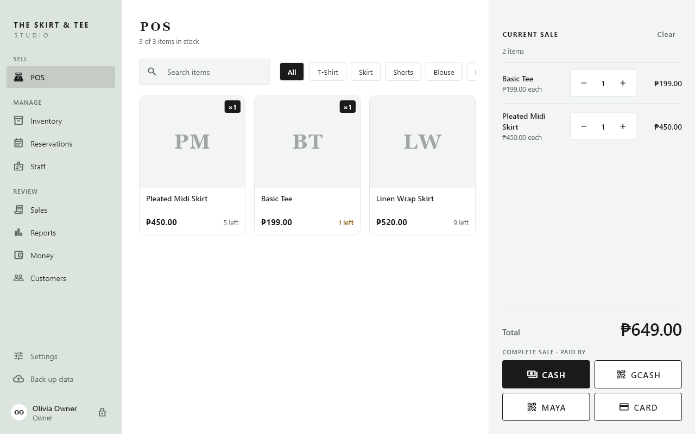
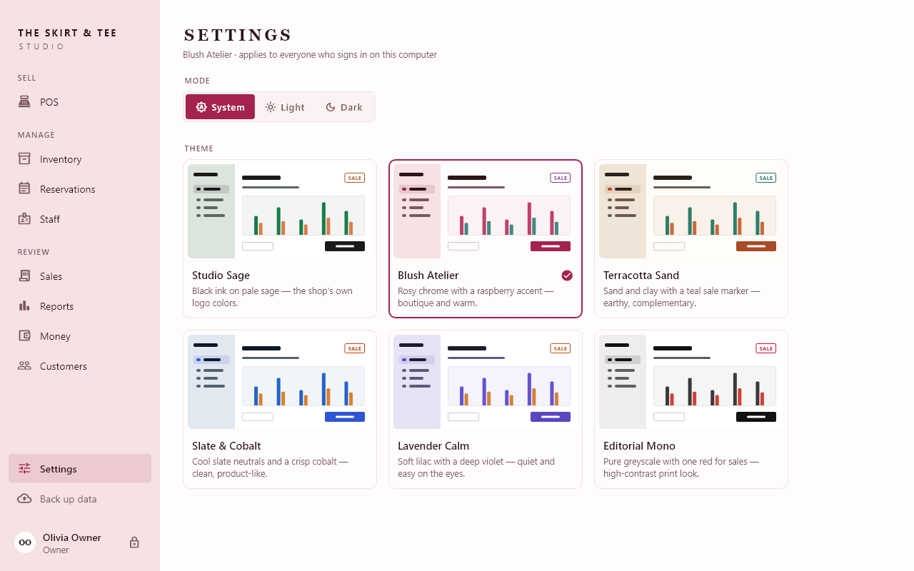
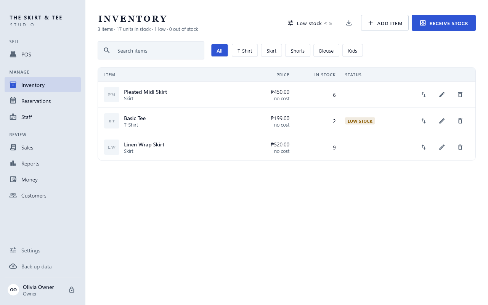
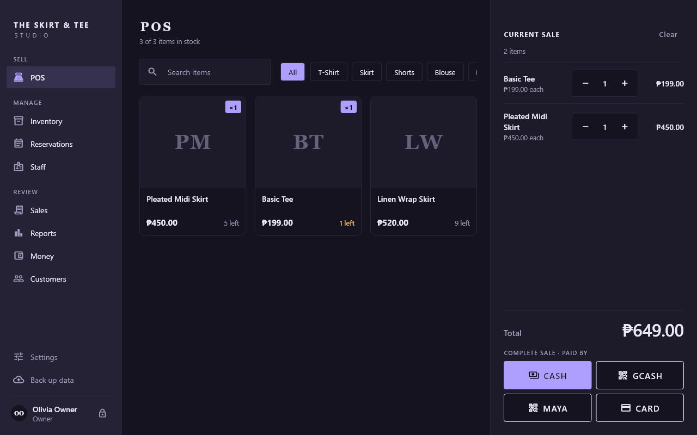
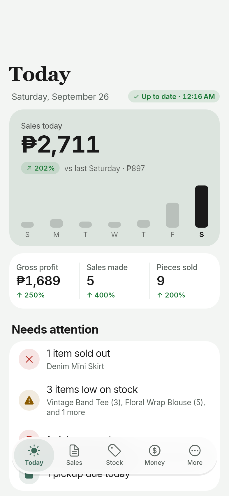
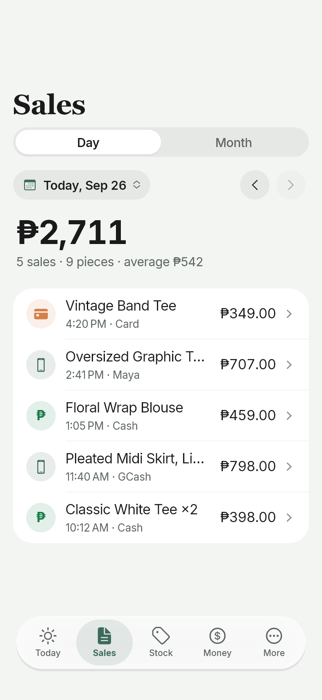
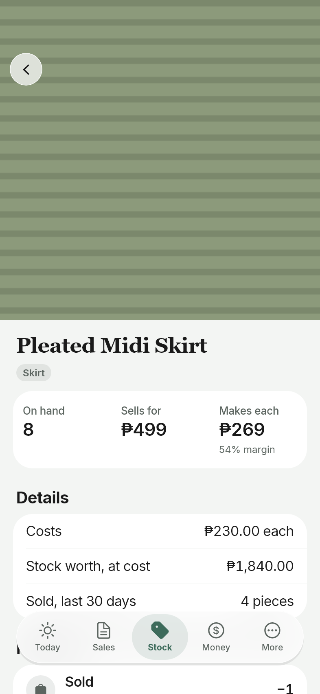
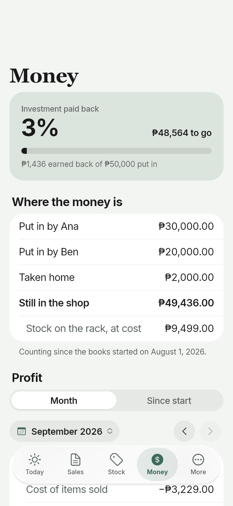

# The Skirt & Tee Studio — POS, Inventory, and Owner App

Point-of-sale and inventory software for **The Skirt & Tee Studio**, a small clothing boutique. It's built with Flutter as two apps:

- **The desktop app** runs on the shop computer. It rings up sales, manages stock, and keeps working offline. Once an owner connects it, it also backs everything up to the cloud (Supabase).
- **The owner mobile app** is an iPhone app that lets the owners check on the shop from anywhere. It shows the shop computer's data as it syncs.



## Desktop app features

- **POS**: search and filter items by category, build a sale, and take payment by cash, GCash, Maya, or card. Cash payments work out the change.
- **Inventory**: items with photos, prices, stock counts, and a configurable low-stock warning. **Receive stock** records a bulk purchase lot and splits its cost (including shipping) across the pieces. **Adjust stock** records damaged, lost, or found pieces.
- **Reservations**: log orders that come in through Facebook or chat, then mark them picked up to turn them into a real sale.
- **Sales history**: every transaction with its line items, plus voiding a sale to restore stock.
- **Reports**: revenue trend, top sellers, and revenue by category for the last 7 days, 30 days, or all time.
- **Money** (owners only): money put in, expenses, money taken home, profit breakdown, and how much of the investment has been paid back.
- **Customers**: repeat customers grouped from reservation history, with their pickup rate.
- **Staff and roles**: PIN sign-in with owner and cashier roles, a lock button, and an activity log of every sale, void, and stock or price change.
- **Settings**: six color themes and a System / Light / Dark switch.
- **Cloud backup** (owners only): connect the shop computer to the cloud in **Settings**. Every sale, stock change, money entry, and item photo is copied up whenever the internet is on. If the computer breaks, sign in on a new one and everything comes back.
- **Backup and export**: one-click database backup, plus CSV export of inventory and sales.

## Themes

Pick a theme in **Settings** and it applies right away. Each theme has its own light and dark palette, and every text and button color meets WCAG contrast.

| Theme | Look |
|---|---|
| Studio Sage (default) | Black ink on pale sage, the shop's logo colors |
| Blush Atelier | Rosy chrome with a raspberry accent |
| Terracotta Sand | Sand and clay with a teal SALE marker |
| Slate & Cobalt | Cool slate neutrals and a crisp cobalt |
| Lavender Calm | Soft lilac with a deep violet |
| Editorial Mono | Greyscale with one red for sales |



| Slate & Cobalt, light | Lavender Calm, dark |
|---|---|
|  |  |

## Owner mobile app

An iPhone app for the owners. It signs in with the same owner login as **Cloud backup** and shows what the shop computer records, updated as sales ring up. It's **read-only** for now: selling, stock changes, and money entries are still made on the shop computer.

| Today | Sales | An item | Money |
|---|---|---|---|
|  |  |  |  |

- **Today**: the day's sales against the same day last week, with gross profit and pieces sold. It also shows what needs attention (sold-out and low stock, pickups due or overdue) and the latest sales.
- **Sales**: any day or month, stepped through or picked on a wheel. Each sale shows its items, payment, change, and what the shop made on it.
- **Stock**: every item in a photo grid, searchable and filtered to low or sold out. Each item shows its price, margin, and stock worth, plus its full history of sales, deliveries, and write-offs.
- **Money**: how much of the investment is paid back and where the money is, profit for a month or since the books started, sales against costs by month, and the money log.
- **More**: the account, sync status, and signing out. Signing out removes the shop's data from the phone; it stays safe in the cloud and on the shop computer.

The app follows iOS 26 design: a floating glass tab bar, large titles, inset-grouped lists, and swipe-back navigation. It adapts to light and dark mode.

## Getting started

**You need:** the [Flutter SDK](https://docs.flutter.dev/get-started/install) (Dart 3.13 or newer), plus Visual Studio with the "Desktop development with C++" workload for Windows builds.

The repo is a Dart workspace: the desktop app lives in `apps/desktop`, the owner mobile app in `apps/owner_mobile`, and the code they share in `packages/shop_core`. One `flutter pub get` at the root sets up all three.

```bash
flutter pub get
cd apps/desktop
flutter run -d windows
```

**First sign-in:** on first launch, the app asks you to set up the owner account with a PIN. After that, the owner can add cashiers from the **Staff** screen.

**Where your data lives:** on the shop computer, in a local database that works without internet. If an owner has connected **Cloud backup**, it's copied to Supabase too. **Back up data** in the sidebar still saves a local copy.

### Cloud backup setup

Cloud backup needs a Supabase project and a PowerSync instance. A build without them runs offline-only, exactly as before.

1. **Supabase:** apply the schema with the Supabase CLI (installed per-project: `npm install`), then create each owner's login under **Authentication → Users**:

   ```bash
   npx supabase login
   npx supabase link --project-ref <project-ref>
   npx supabase db push
   ```

   `npx supabase db query --linked -f supabase/tests/smoke_test.sql` checks the live schema and rolls itself back. It should end with `SMOKE TEST PASSED`.
2. **PowerSync:** create an instance connected to the Supabase database, turn on Supabase Auth, and deploy [`supabase/powersync/sync-rules.yaml`](supabase/powersync/sync-rules.yaml) as its sync rules.
3. **App config:** at the repo root, copy `cloud.example.json` to `cloud.json` and fill in the Supabase URL, the **publishable** key, and the PowerSync URL. `cloud.json` is gitignored. Never put the Supabase *secret* key in it: the app ships to the shop computer, and the secret key bypasses every access rule.

   ```bash
   cd apps/desktop
   flutter run -d windows --dart-define-from-file=../../cloud.json
   ```

**First run after updating:** the app copies the old local database into the new one once. The original file stays untouched, and a copy is saved next to it as `skirt_tee_studio.pre-cloud.db`.

**Restoring on a new computer:** install the app, set up the owner PIN (staff PINs never leave the computer they were made on), then **Settings → Connect to cloud** with the owner login. Everything downloads, photos included.

### Owner mobile app

The phone reads what the shop computer uploads, so set up **Cloud backup** first. The phone uses the same `cloud.json`:

```bash
cd apps/owner_mobile
flutter run --dart-define-from-file=../../cloud.json
```

Sign in with an owner login from Supabase **Authentication → Users**, the same one the shop computer uses. The phone joins the shop the computer created and keeps an offline copy of its data. A build without `cloud.json` shows a screen explaining that it has no cloud settings.

**Where it runs:** the app is designed for iPhone, and building for iPhone needs a Mac with Xcode. Until then, test it on an Android phone or on Windows (`-d windows`, which opens a window at iPhone 15 size). Off Apple devices it uses [Inter](https://rsms.me/inter/) in place of the iPhone's system font, and debug builds behave like an iPhone.

## Development

Run these inside `packages/shop_core`, `apps/desktop`, or `apps/owner_mobile`; each has its own tests:

```bash
flutter test          # unit and widget tests
flutter analyze       # lints
flutter build windows # release build (apps/desktop only)
```

To review UI changes as images, run `flutter test tool/ui_snapshots_test.dart` in `apps/desktop` or `apps/owner_mobile`. It renders every screen in light and dark to `build/ui_snapshots/`; the mobile app's screens render at iPhone 15 size. It's Windows-only, since it reads Windows fonts.

### Project structure

```
apps/desktop/         the Windows POS app (MVVM with `provider`)
  lib/core/           routing, DI, utilities
  lib/data/sync/      one-time import of the pre-cloud database
  lib/presentation/   screens, view models, and widgets
apps/owner_mobile/    the owners' iPhone app (Cupertino, MVVM with `provider`)
  lib/core/           DI, periods, the Cupertino theme and design tokens
  lib/presentation/   the five tabs, detail screens, view models, and widgets
  assets/             line-art animations and the Inter font
packages/shop_core/   shared by both apps
  lib/domain/         entities and repository interfaces
  lib/data/           local database, repositories, and cloud sync (data/sync)
  lib/calculations/   profit, payback, reports, and customer/sales grouping
  lib/core/           cloud config and the theme presets
supabase/             database migrations, PowerSync sync config, smoke test
```

Architecture, database, and sequence diagrams are in [`docs/diagrams`](docs/diagrams). The roadmap and what's planned next are in [`ROADMAP.md`](ROADMAP.md).

## Tech

- **Both apps:** Flutter · `provider` · PowerSync (`powersync`, `sqlite_async`) · Supabase (`supabase_flutter`) · `fl_chart` · `lottie`
- **Desktop:** `file_selector` · `window_manager`
- **Mobile:** Cupertino widgets throughout (no Material) · Inter off Apple devices
